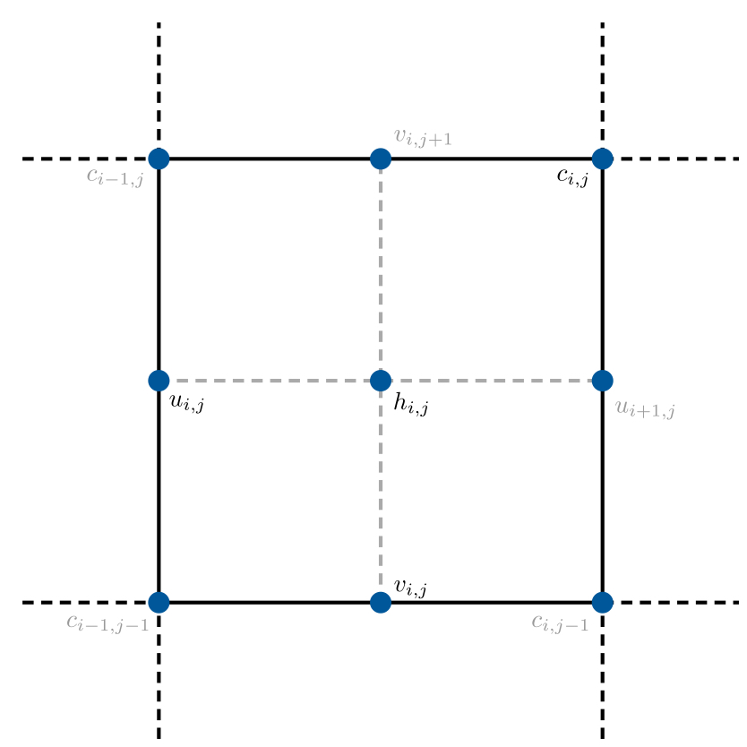

# Numerical Grid

WAVI.jl solves the [governing equations](../physics/governing_equations.md) on a rectangular grid, with $n_x$ grid cells in the $x$ direction and $n_y$ grid cells in the $y$ direction. Ice thickness values $h$ are defined at the cell centers (see figure) of grid cells, while velocity components $\bar{u}$ and $\bar{v}$ are defined along grid cell edges, and shear strain rates $c = (\partial u /\partial y + \partial v / \partial x)/2$ are stored at grid corners.

```@raw html
<center>
<figcaption>Figure 1: Locations within grid cells that ice thickness $h$, velocity components $u$ and $v$, and shear strain rates $c = (\partial u /\partial y + \partial v / \partial x)/2$ are stored. </figcaption></center>
```


The set of all such points at which the ice thickness is stored defines the $h$-grid. The $u$-grid, $v$-grid, and $c$-grid are defined analagously. Various different quantities are also stored on each of these grids, and used as part of the solution (see [Fields](../data_structure/fields.md) for more information).

Three dimensional fields used in the governing equations (e.g. viscosity) are stored $h$-grid points, extrapolated into the $z$ direction. This grid is referred to as the $\sigma$-grid.