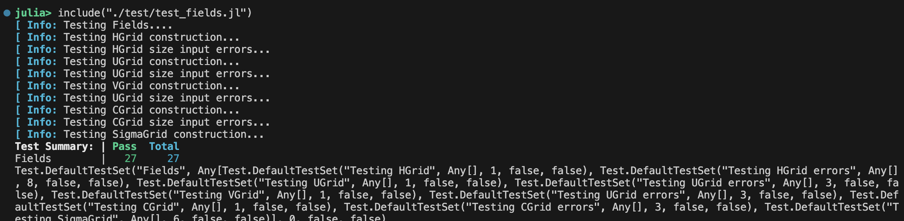

# WAVI.jl tests
WAVI.jl includes a comprehensive suite of unit tests, which help to prevent bugs, ensure code quality, and prevent breaking changes. Scripts to run these tests are held in the `/test` folder. These tests utilize the [Julia unit testing architechture](https://docs.julialang.org/en/v1/stdlib/Test/), which provides a streamlined environment for testing.

WAVI.jl includes 10 individual testing scripts, `/test/test_XXXXX.jl`. These roughly correspond to each level of the [data structure](./API/overview.md) heirarchy, with a couple of extras. They are
- `/test/test_fields.jl`: test the [WAVI.jl fields structures](./API/fields.md).
- `/test/test_grids.jl`: test the [WAVI.jl grid structures](./API/fields.md).
- `/test/test_kronecker.jl`: test the Kronecker product operations used in WAVI.jl.
- `/test/test_melt.jl`: test the [WAVI.jl basal melt rate parametrizations](./API/melt_rate_models.md).
- `/test/test_models.jl`: test the [WAVI.jl model structures](./API/model.md).
- `/test/test_outputting.jl`: test the [WAVI.jl output writing structures](./API/output_writing.md).
- `/test/test_simulations.jl`: test the [WAVI.jl simulation structures](./API/simulations.md).
- `/test/test_timesteppingparams.jl`: test the [WAVI.jl timestepping parameters structures](./API/timestepping_params.md).
- `/test/test_utils.jl`: test the utility functions employed by WAVI.jl.
- `/test/verification_tests.jl`: verification tests for the WAVI.jl model. Note that these tests require setup and running of a WAVI.jl simulation and therefore take a while!   

Individual unit tests can be run by running the corresponding Julia script (note that WAVI.jl must be installed)
```julia
julia> include('./test/test_XXXXX.jl')
```
The output will appear as below (in this case for `/test/test_fields.jl`). The test summary lists the total number of tests, alongside the number which pass and fail. 

```@raw html
<center></center>
```

The full suite of tests can be run using the `runtests.jl` script (non-MPI tests plus MPI tests launched as subprocesses via [`mpiexec()`](https://juliaparallel.org/MPI.jl/stable/usage/#Writing-MPI-tests)). 
```julia
julia> include('./test/runtests.jl')
```

For faster structural-only runs (no MPI, no verification), use `runtests_structure.jl` as in CI.

## MPI tests (MPISpec)

MPISpec tests follow the [MPI.jl recommended pattern](https://juliaparallel.org/MPI.jl/stable/usage/#Writing-MPI-tests): a normal Julia process runs a driver that spawns the MPI test script with `mpiexec()`. You do not need to wrap the driver in `mpiexecjl` yourself.

| Driver | What runs |
|--------|-----------|
| `test/runtests_mpi_unit.jl` | Fast checks: halo exchange and global collect on a small `MPISpec` grid (two MPI ranks). MPI+GPU (`child_architecture = GPU()`) runs only if CUDA.jl is in the active project *and* a device is visible. `julia --project=test` skips it; on a GPU node use `--project=benchmarks`. |
| `test/runtests_mpi_integration.jl` | Short Iceberg-style run comparing `MPISpec` to `BasicSpec` on two ranks (slower than unit). |

From the repository root (after `Pkg.instantiate()` in the `test` project):

```bash
julia --project=test test/runtests_mpi_unit.jl
julia --project=test test/runtests_mpi_integration.jl
```

MPI+GPU unit tests need CUDA.jl, which is not in `test/Project.toml`. On a GPU node:

```bash
julia --project=benchmarks test/runtests_mpi_unit.jl
```

To debug a single MPI test script directly under MPI (optional), use [`mpiexecjl`](https://juliaparallel.org/MPI.jl/stable/usage/#Julia-wrapper-for-mpiexec) as described in [Model specifications](./model_specifications.md):

```bash
mpiexecjl -n 2 --project=test julia test/mpi_tests/test_mpispec_halo_collect.jl
```

## Continuous Integration

The GitHub Actions workflow runs `test/runtests_structure.jl` on each supported Julia version, and a separate job runs `test/runtests_mpi_unit.jl` (MPI subprocesses via `mpiexec()` inside Julia). The integration driver is for local or scheduled runs only (not part of the default CI workflow).
